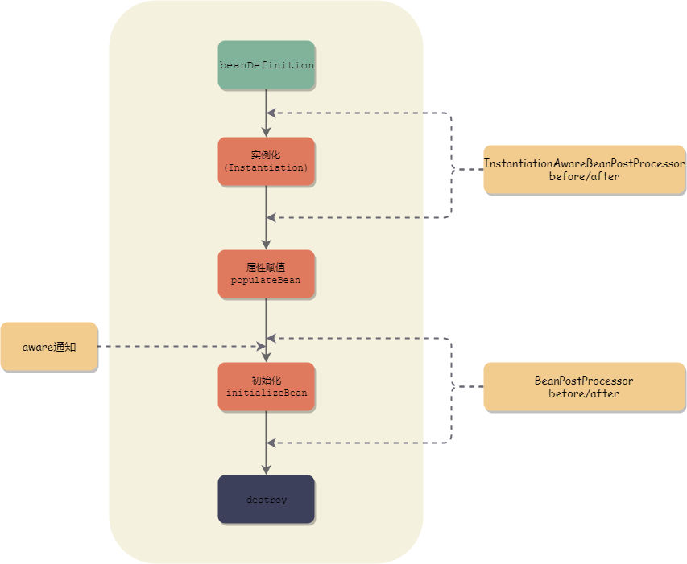
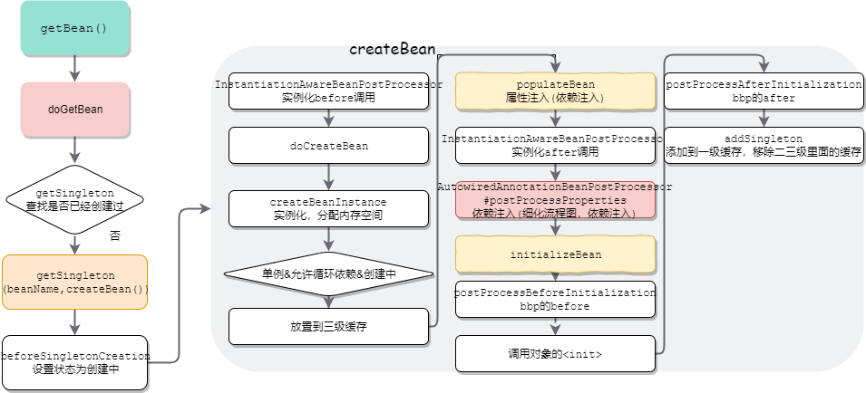

# 生命周期




大致分为四个分别为 实例化>属性赋值>实例化>销毁， 其中实例化前后会分别调用instantiationAwareBeanpostProcessor#before#after， 实例化前后会调用beanpostprocessor#before#after，

并且，在实例化之前会注入各种AWARE感知系统属性例如获取上下文 ，可以从中获取环境属性，实例化阶段调用initializingBean 如果实现了init_method。bean销毁之前调用disposableBean

# 源码分析



## doGetBean

```java
	/**
	 * Return an instance, which may be shared or independent, of the specified bean.
	 * @param name the name of the bean to retrieve
	 * @param requiredType the required type of the bean to retrieve
	 * @param args arguments to use when creating a bean instance using explicit arguments
	 * (only applied when creating a new instance as opposed to retrieving an existing one)
	 * @param typeCheckOnly whether the instance is obtained for a type check,
	 * not for actual use
	 * @return an instance of the bean
	 * @throws BeansException if the bean could not be created
	 */
	@SuppressWarnings("unchecked")
	protected <T> T doGetBean(final String name, @Nullable final Class<T> requiredType,
			@Nullable final Object[] args, boolean typeCheckOnly) throws BeansException {

		/**
		 * Return the bean name, stripping out the factory dereference prefix if necessary,
		 * and resolving aliases to canonical names.
		 * 返回 bean 名称，必要时去除工厂取消引用前缀，并将别名解析为规范名称, 前面（容器的启动）可以看到factoryBean的名字是加了一个&
		 */
		final String beanName = transformedBeanName(name);
		Object bean;

		// Eagerly check singleton cache for manually registered singletons.
		// 先检查缓存，是否已经创建过了
		Object sharedInstance = getSingleton(beanName);
		if (sharedInstance != null && args == null) {
			if (logger.isTraceEnabled()) {
				if (isSingletonCurrentlyInCreation(beanName)) {
					logger.trace("Returning eagerly cached instance of singleton bean '" + beanName +
							"' that is not fully initialized yet - a consequence of a circular reference");
				}
				else {
					logger.trace("Returning cached instance of singleton bean '" + beanName + "'");
				}
			}
			bean = getObjectForBeanInstance(sharedInstance, name, beanName, null);
		}

		else {
			// 忽略代码... 
				// Create bean instance.
				if (mbd.isSingleton()) {
					// 这里会先设置bean在创建状态，重点
					sharedInstance = getSingleton(beanName, () -> {
						try {
							//进行创建 重点
							return createBean(beanName, mbd, args);
						}
						catch (BeansException ex) {
							// Explicitly remove instance from singleton cache: It might have been put there
							// eagerly by the creation process, to allow for circular reference resolution.
							// Also remove any beans that received a temporary reference to the bean.
							destroySingleton(beanName);
							throw ex;
						}
					});
					bean = getObjectForBeanInstance(sharedInstance, name, beanName, mbd);
				}

				else if (mbd.isPrototype()) {
					// It's a prototype -> create a new instance.
					Object prototypeInstance = null;
					try {
						beforePrototypeCreation(beanName);
						prototypeInstance = createBean(beanName, mbd, args);
					}
					finally {
						afterPrototypeCreation(beanName);
					}
					bean = getObjectForBeanInstance(prototypeInstance, name, beanName, mbd);
				}

				else {
					String scopeName = mbd.getScope();
					final Scope scope = this.scopes.get(scopeName);
					if (scope == null) {
						throw new IllegalStateException("No Scope registered for scope name '" + scopeName + "'");
					}
					try {
						Object scopedInstance = scope.get(beanName, () -> {
							beforePrototypeCreation(beanName);
							try {
								return createBean(beanName, mbd, args);
							}
							finally {
								afterPrototypeCreation(beanName);
							}
						});
						bean = getObjectForBeanInstance(scopedInstance, name, beanName, mbd);
					}
					catch (IllegalStateException ex) {
						throw new BeanCreationException(beanName,
								"Scope '" + scopeName + "' is not active for the current thread; consider " +
								"defining a scoped proxy for this bean if you intend to refer to it from a singleton",
								ex);
					}
				}
			}
			catch (BeansException ex) {
				cleanupAfterBeanCreationFailure(beanName);
				throw ex;
			}
		}

		// Check if required type matches the type of the actual bean instance.
		if (requiredType != null && !requiredType.isInstance(bean)) {
			try {
				T convertedBean = getTypeConverter().convertIfNecessary(bean, requiredType);
				if (convertedBean == null) {
					throw new BeanNotOfRequiredTypeException(name, requiredType, bean.getClass());
				}
				return convertedBean;
			}
			catch (TypeMismatchException ex) {
				if (logger.isTraceEnabled()) {
					logger.trace("Failed to convert bean '" + name + "' to required type '" +
							ClassUtils.getQualifiedName(requiredType) + "'", ex);
				}
				throw new BeanNotOfRequiredTypeException(name, requiredType, bean.getClass());
			}
		}
		return (T) bean;
	}
// 
	protected Object getSingleton(String beanName, boolean allowEarlyReference) {
		//先在一级缓存查找
		Object singletonObject = this.singletonObjects.get(beanName);
		if (singletonObject == null && isSingletonCurrentlyInCreation(beanName)) {
			//一级缓存找不到，但是该对象在创建中，代表已经有循环依赖了
			synchronized (this.singletonObjects) {
				//在二级缓存中找
				singletonObject = this.earlySingletonObjects.get(beanName);
				if (singletonObject == null && allowEarlyReference) {
					//二级缓存找不到，并且允许提前引用，则去三级缓存找
					ObjectFactory<?> singletonFactory = this.singletonFactories.get(beanName);
					if (singletonFactory != null) {
						// 这里执行三级缓存存放的lambda 注意这里的getEarlyBeanReference 里面实际会有AOP的逻辑，如果是需要代理的话，这个步骤会生成代理对象
						//但是这个代理对象是还未初始化的，说明即使是AOP的对象也是保持了一致的初始化流程
						singletonObject = singletonFactory.getObject();
						//放到二级缓存，然后移除三级缓存里面的，避免重复的AOP
						this.earlySingletonObjects.put(beanName, singletonObject);
						this.singletonFactories.remove(beanName);
					}
				}
			}
		}
		return singletonObject;
	}

```

## `getSingleton(String beanName, ObjectFactory<?> singletonFactory)`

```java
/**
	 * Return the (raw) singleton object registered under the given name,
	 * creating and registering a new one if none registered yet.
	 * @param beanName the name of the bean
	 * @param singletonFactory the ObjectFactory to lazily create the singleton
	 * with, if necessary
	 * @return the registered singleton object
	 */
	public Object getSingleton(String beanName, ObjectFactory<?> singletonFactory) {
		Assert.notNull(beanName, "Bean name must not be null");
		synchronized (this.singletonObjects) {
			Object singletonObject = this.singletonObjects.get(beanName);
			if (singletonObject == null) {
				if (this.singletonsCurrentlyInDestruction) {
					throw new BeanCreationNotAllowedException(beanName,
							"Singleton bean creation not allowed while singletons of this factory are in destruction " +
							"(Do not request a bean from a BeanFactory in a destroy method implementation!)");
				}
				if (logger.isDebugEnabled()) {
					logger.debug("Creating shared instance of singleton bean '" + beanName + "'");
				}
				// 设置bean的状态为创建中
				beforeSingletonCreation(beanName);
				boolean newSingleton = false;
				boolean recordSuppressedExceptions = (this.suppressedExceptions == null);
				if (recordSuppressedExceptions) {
					this.suppressedExceptions = new LinkedHashSet<>();
				}
				try {
                    // 这里就是执行createBean方法
					singletonObject = singletonFactory.getObject();
					newSingleton = true;
				}
				catch (IllegalStateException ex) {
					// Has the singleton object implicitly appeared in the meantime ->
					// if yes, proceed with it since the exception indicates that state.
					singletonObject = this.singletonObjects.get(beanName);
					if (singletonObject == null) {
						throw ex;
					}
				}
				catch (BeanCreationException ex) {
					if (recordSuppressedExceptions) {
						for (Exception suppressedException : this.suppressedExceptions) {
							ex.addRelatedCause(suppressedException);
						}
					}
					throw ex;
				}
				finally {
					if (recordSuppressedExceptions) {
						this.suppressedExceptions = null;
					}
					//取消Bean的创建中状态
					afterSingletonCreation(beanName);
				}
				if (newSingleton) {
					//新创建的bean， 放到一级缓存，并且从二三级缓存中移除
					addSingleton(beanName, singletonObject);
				}
			}
			return singletonObject;
		}
	}
```


## createBean

```java
/**
	 * 核心方法
	 * Central method of this class: creates a bean instance,
	 * populates the bean instance, applies post-processors, etc.
	 * @see #doCreateBean
	 */
	@Override
	protected Object createBean(String beanName, RootBeanDefinition mbd, @Nullable Object[] args)
			throws BeanCreationException {

		if (logger.isTraceEnabled()) {
			logger.trace("Creating instance of bean '" + beanName + "'");
		}
		RootBeanDefinition mbdToUse = mbd;

		// Make sure bean class is actually resolved at this point, and
		// clone the bean definition in case of a dynamically resolved Class
		// which cannot be stored in the shared merged bean definition.
		Class<?> resolvedClass = resolveBeanClass(mbd, beanName);
		if (resolvedClass != null && !mbd.hasBeanClass() && mbd.getBeanClassName() != null) {
			mbdToUse = new RootBeanDefinition(mbd);
			mbdToUse.setBeanClass(resolvedClass);
		}

		// Prepare method overrides.
		try {
			mbdToUse.prepareMethodOverrides();
		}
		catch (BeanDefinitionValidationException ex) {
			throw new BeanDefinitionStoreException(mbdToUse.getResourceDescription(),
					beanName, "Validation of method overrides failed", ex);
		}

		try {
			// Give BeanPostProcessors a chance to return a proxy instead of the target bean instance.
			// 调用 InstantiationAwareBeanPostProcessor#postProcessBeforeInstantiation 实例化的后置处理器
			Object bean = resolveBeforeInstantiation(beanName, mbdToUse);
			if (bean != null) {
				return bean;
			}
		}
		catch (Throwable ex) {
			throw new BeanCreationException(mbdToUse.getResourceDescription(), beanName,
					"BeanPostProcessor before instantiation of bean failed", ex);
		}

		try {
			// 实际创建  又是doXXX
			Object beanInstance = doCreateBean(beanName, mbdToUse, args);
			if (logger.isTraceEnabled()) {
				logger.trace("Finished creating instance of bean '" + beanName + "'");
			}
			return beanInstance;
		}
		catch (BeanCreationException | ImplicitlyAppearedSingletonException ex) {
			// A previously detected exception with proper bean creation context already,
			// or illegal singleton state to be communicated up to DefaultSingletonBeanRegistry.
			throw ex;
		}
		catch (Throwable ex) {
			throw new BeanCreationException(
					mbdToUse.getResourceDescription(), beanName, "Unexpected exception during bean creation", ex);
		}
	}
```

## 核心doCreateBean

```java
/**
	 * Actually create the specified bean. Pre-creation processing has already happened
	 * at this point, e.g. checking {@code postProcessBeforeInstantiation} callbacks.
	 * <p>Differentiates between default bean instantiation, use of a
	 * factory method, and autowiring a constructor.
	 * @param beanName the name of the bean
	 * @param mbd the merged bean definition for the bean
	 * @param args explicit arguments to use for constructor or factory method invocation
	 * @return a new instance of the bean
	 * @throws BeanCreationException if the bean could not be created
	 * @see #instantiateBean
	 * @see #instantiateUsingFactoryMethod
	 * @see #autowireConstructor
	 */
	protected Object doCreateBean(final String beanName, final RootBeanDefinition mbd, final @Nullable Object[] args)
			throws BeanCreationException {

		// Instantiate the bean.
		BeanWrapper instanceWrapper = null;
		if (mbd.isSingleton()) {
			//如果是单例，则从factoryBeanCache移除，TODO 待理解
			instanceWrapper = this.factoryBeanInstanceCache.remove(beanName);
		}
		if (instanceWrapper == null) {
			// 实例化bean
			instanceWrapper = createBeanInstance(beanName, mbd, args);
		}
		final Object bean = instanceWrapper.getWrappedInstance();
		Class<?> beanType = instanceWrapper.getWrappedClass();
		if (beanType != NullBean.class) {
			mbd.resolvedTargetType = beanType;
		}

...

		// Eagerly cache singletons to be able to resolve circular references
		// even when triggered by lifecycle interfaces like BeanFactoryAware.
		// 判断当前bean是否需要提前曝光，单例 允许cr 创建中
		boolean earlySingletonExposure = (mbd.isSingleton() && this.allowCircularReferences &&
				isSingletonCurrentlyInCreation(beanName));
		if (earlySingletonExposure) {
			if (logger.isTraceEnabled()) {
				logger.trace("Eagerly caching bean '" + beanName +
						"' to allow for resolving potential circular references");
			}
			//Ⅲ 添加到三级缓存，循环依赖要用,注意这里的getEarlyBeanReference aop逻辑在里面
			addSingletonFactory(beanName, () -> getEarlyBeanReference(beanName, mbd, bean));
		}

		// Initialize the bean instance.
		Object exposedObject = bean;
		try {
			//填充bean属性，依赖注入会递归初始化依赖的bean
			populateBean(beanName, mbd, instanceWrapper);
			//执行初始化
			exposedObject = initializeBean(beanName, exposedObject, mbd);
		}
		catch (Throwable ex) {
			if (ex instanceof BeanCreationException && beanName.equals(((BeanCreationException) ex).getBeanName())) {
				throw (BeanCreationException) ex;
			}
			else {
				throw new BeanCreationException(
						mbd.getResourceDescription(), beanName, "Initialization of bean failed", ex);
			}
		}

		if (earlySingletonExposure) {
			//allowEarlyReference== false 代表只能从一二级里面获取，此时创建中，一级缓存肯定没有，只可能存在二级缓存中
			Object earlySingletonReference = getSingleton(beanName, false);
			if (earlySingletonReference != null) {
				//二级缓存中存在，代表已经被循环依赖过，有可能已经是aop增强过
				//exposedObject就是要放到一级缓存的对象
				if (exposedObject == bean) { //这里的判断是避免错乱？
					//替换成 增强过后的对象
					exposedObject = earlySingletonReference;
				}
				else if (!this.allowRawInjectionDespiteWrapping && hasDependentBean(beanName)) {
					String[] dependentBeans = getDependentBeans(beanName);
					Set<String> actualDependentBeans = new LinkedHashSet<>(dependentBeans.length);
					for (String dependentBean : dependentBeans) {
						if (!removeSingletonIfCreatedForTypeCheckOnly(dependentBean)) {
							actualDependentBeans.add(dependentBean);
						}
					}
					if (!actualDependentBeans.isEmpty()) {
						throw new BeanCurrentlyInCreationException(beanName,
								"Bean with name '" + beanName + "' has been injected into other beans [" +
								StringUtils.collectionToCommaDelimitedString(actualDependentBeans) +
								"] in its raw version as part of a circular reference, but has eventually been " +
								"wrapped. This means that said other beans do not use the final version of the " +
								"bean. This is often the result of over-eager type matching - consider using " +
								"'getBeanNamesOfType' with the 'allowEagerInit' flag turned off, for example.");
					}
				}
			}
		}

		// Register bean as disposable.
		try {
			registerDisposableBeanIfNecessary(beanName, bean, mbd);
		}
		catch (BeanDefinitionValidationException ex) {
			throw new BeanCreationException(
					mbd.getResourceDescription(), beanName, "Invalid destruction signature", ex);
		}

		return exposedObject;
	}
```

## populateBean

```java
/**
	 * Populate the bean instance in the given BeanWrapper with the property values
	 * from the bean definition.
	 * @param beanName the name of the bean
	 * @param mbd the bean definition for the bean
	 * @param bw the BeanWrapper with bean instance
	 */
	@SuppressWarnings("deprecation")  // for postProcessPropertyValues
	protected void populateBean(String beanName, RootBeanDefinition mbd, @Nullable BeanWrapper bw) {
		if (bw == null) {
			if (mbd.hasPropertyValues()) {
				throw new BeanCreationException(
						mbd.getResourceDescription(), beanName, "Cannot apply property values to null instance");
			}
			else {
				// Skip property population phase for null instance.
				return;
			}
		}

		...

		PropertyDescriptor[] filteredPds = null;
		if (hasInstAwareBpps) {
			if (pvs == null) {
				pvs = mbd.getPropertyValues();
			}
			for (BeanPostProcessor bp : getBeanPostProcessors()) {
				if (bp instanceof InstantiationAwareBeanPostProcessor) {
					InstantiationAwareBeanPostProcessor ibp = (InstantiationAwareBeanPostProcessor) bp;
					// AutowiredAnnotationBeanPostProcessor 会在这里完成依赖注入
					PropertyValues pvsToUse = ibp.postProcessProperties(pvs, bw.getWrappedInstance(), beanName);
					if (pvsToUse == null) {
						if (filteredPds == null) {
							filteredPds = filterPropertyDescriptorsForDependencyCheck(bw, mbd.allowCaching);
						}
						pvsToUse = ibp.postProcessPropertyValues(pvs, filteredPds, bw.getWrappedInstance(), beanName);
						if (pvsToUse == null) {
							return;
						}
					}
					pvs = pvsToUse;
				}
			}
		}
		if (needsDepCheck) {
			if (filteredPds == null) {
				filteredPds = filterPropertyDescriptorsForDependencyCheck(bw, mbd.allowCaching);
			}
			checkDependencies(beanName, mbd, filteredPds, pvs);
		}

		if (pvs != null) {
			//依赖注入
			applyPropertyValues(beanName, mbd, bw, pvs);
		}
	}
```

## 依赖注入

这里发生在`populateBean` 里面调用 `AutowiredAnnotationBeanPostProcessor#postProcessProperties`

- 解析依赖

  ```java
  	@Override
  	public PropertyValues postProcessProperties(PropertyValues pvs, Object bean, String beanName) {
  		//获取显式autowire
  		InjectionMetadata metadata = findAutowiringMetadata(beanName, bean.getClass(), pvs);
  		try {
  			//进行注入
  			metadata.inject(bean, beanName, pvs);
  		}
  		catch (BeanCreationException ex) {
  			throw ex;
  		}
  		catch (Throwable ex) {
  			throw new BeanCreationException(beanName, "Injection of autowired dependencies failed", ex);
  		}
  		return pvs;
  	}
  
  
  ```

​		


- 注入

  ```java
      	public void inject(Object target, @Nullable String beanName, @Nullable PropertyValues pvs) throws Throwable {
  		Collection<InjectedElement> checkedElements = this.checkedElements;
  		Collection<InjectedElement> elementsToIterate =
  				(checkedElements != null ? checkedElements : this.injectedElements);
  		if (!elementsToIterate.isEmpty()) {
  			for (InjectedElement element : elementsToIterate) {
  				if (logger.isTraceEnabled()) {
  					logger.trace("Processing injected element of bean '" + beanName + "': " + element);
  				}
  				// AutowiredFieldElement.inject
  				element.inject(target, beanName, pvs);
  			}
  		}
  	}
  
      @Override
  		protected void inject(Object bean, @Nullable String beanName, @Nullable PropertyValues pvs) throws Throwable {
  			Field field = (Field) this.member;
  			Object value;
  			if (this.cached) {
  				value = resolvedCachedArgument(beanName, this.cachedFieldValue);
  			}
  			else {
  ...
  				try {
  					//解析获取依赖
  					value = beanFactory.resolveDependency(desc, beanName, autowiredBeanNames, typeConverter);
  				}
  				catch (BeansException ex) {
  					throw new UnsatisfiedDependencyException(null, beanName, new InjectionPoint(field), ex);
  				}
              }
              
     	@Override
  	@Nullable
  	public Object resolveDependency(DependencyDescriptor descriptor, @Nullable String requestingBeanName,
  			@Nullable Set<String> autowiredBeanNames, @Nullable TypeConverter typeConverter) throws BeansException {
  
  
  		else {
  			Object result = getAutowireCandidateResolver().getLazyResolutionProxyIfNecessary(
  					descriptor, requestingBeanName);
  			if (result == null) {
                  //真正执行 
  				result = doResolveDependency(descriptor, requestingBeanName, autowiredBeanNames, typeConverter);
                  //里面调用 resolveCandidate
  			}
  			return result;
  		}
  	}
              
              	/**
  	 * Resolve the specified bean name, as a candidate result of the matching
  	 * algorithm for this dependency, to a bean instance from the given factory.
  	 * <p>The default implementation calls {@link BeanFactory#getBean(String)}.
  	 * Subclasses may provide additional arguments or other customizations.
  	 * @param beanName the bean name, as a candidate result for this dependency
  	 * @param requiredType the expected type of the bean (as an assertion)
  	 * @param beanFactory the associated factory
  	 * @return the bean instance (never {@code null})
  	 * @throws BeansException if the bean could not be obtained
  	 * @since 4.3.2
  	 * @see BeanFactory#getBean(String)
  	 */
  	public Object resolveCandidate(String beanName, Class<?> requiredType, BeanFactory beanFactory)
  			throws BeansException {
  		//走回老路，getBean
  		return beanFactory.getBean(beanName);
  	}
  ```

  

# 循环依赖


这一章节其实张sir说的很清楚，包括只以一二三层解决这个循环依赖会出现什么问题，也有描述

# 参考

[熬丙](https://mp.weixin.qq.com/s/u29hMRkfTj_1RHNSukDtEw)

[张air循环依赖](https://xie.infoq.cn/article/e3b46dc2c0125ab812f9aa977?utm_source=related_read_bottom&utm_medium=article)

